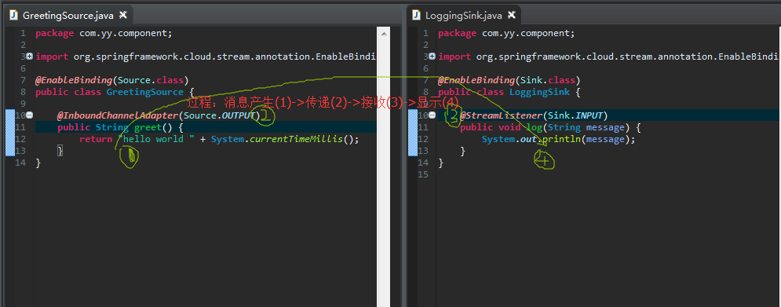

# springcloud_demo

项目：
(1)springcloud_demo_registry_center #eureka注册中心

(2)springcloud_demo_provider #注册服务，服务会向注册中心注册

(3)springcloud_demo_provider2 #注册服务，同样，服务会向注册中心注册,

(4)springcloud_demo_consumer_ribbon #使用ribbon实现负载均衡 同时也加入了断路器

(5)springcloud_demo_consumer_feign #使用feign实现负载均衡 同时也加入了断路器

(6)springcloud_demo_consumer_ribbon_hystrixdashborad #使用hystrixdashborad负载均衡监控

(7)springcloud_demo_consumer_turbine #使用turbine负载均衡监控

(8)springcloud_demo_config_server #配置服务端

(9)springcloud_demo_config_client #配置客户端

(10)springcloud_demo_config #配置仓库

(11)springcloud_demo_gateway #服务网关

(12)springcloud_demo_registry_center_cluster_node2 #eureka注册中心 node2

(13)springcloud_demo_registry_center_cluster_node2 #eureka注册中心 node3

(14)springcloud_demo_registry_center_cluster_node2 #eureka注册中心 node4

(15)springcloud_demo_stream stream server端

(16)springcloud_demo_stream_consumer stream consumer端

## 项目启动步骤说明：
## Spring-Cloud-Eureka创建服务注册中心和服务注册实例
   查看服务在注册中心的情况
   需启动项目(1)、(2)，访问注册中心地址：http://localhost:1111
   
   
## Spring-Cloud-Netflix-ribbon负载均衡实例
   启动项目(1)、(2)、(3)、(4)，访问地址：http://localhost:3333/add,多刷新几次，之后查看项目(2)、(3)的console日志信息
   会看到：
   ```
   /add, host:hostname, service_id:servicename, result:30
   ```
   注意：项目(2)、(3)的spring.application.name是一样的，server.port不一样
   

## Spring-Cloud-Netflix-Hystrix断路器实例
   启动项目(1)、(2)、(4)，访问地址：http://localhost:3333/add,正常页面会显示结果：30
   这时关掉项目(2)，再次访问地址：http://localhost:3333/add,如果没有断路器，页面显示：
   ```
   Whitelabel Error Page
   This application has no explicit mapping for /error, so you are seeing this as a fallback.
   Sat Sep 03 15:04:23 CST 2016
   There was an unexpected error (type=Not Found, status=404).
   No message available
   加入断路器后，页面显示：
   error
   ```
   查看项目代码，你会明白他的原理的
   
   注意：测试断路器时，可以不启动注册中心项目(1)，和服务(2),只需启动项目(4)本身，但是项目代码需改动，具体如下：
   1、AppRun注释掉@EnableDiscoveryClient
   2、注释掉ComputeService.addService()方法的
   ```
   return restTemplate.getForEntity("http://SERVICE1/add?a=10&b=20",
   String.class).getBody();，打开原来被注释掉的代码：int randomInt = random.nextInt(10);············· randomInt;
   ```
   3、这时启动项目(4)，访问地址：http://localhost:3333/add，你会看到页面显示正常结果：数字；异常结果：error，如果没有断路器，
   异常结果会显示：
    
   ``` 
   call dependency service fail.
   ```
   这说明断路器起了作用
   
   
## Spring-Cloud-Netflix-Hystrix feign断路器：
   与测试ribbon步骤一样，只不过feign是在类上加断路器，这样所有的方法用这一个断路器就可以了，而ribbon是在
   方法上加断路器，一个方法一个，各有优点，实际还要灵活使用
   
   
## Spring-Cloud-Netflix-Hystrix-Dashborad
   测试hystrixdashborad，启动项目(1)、(2)、(4)、(6)，访问地址：http://localhost:3333/add,再访问地址：http://localhost:3335/hystrix，在页面的输入框中输入：http://localhost:3333/hystrix.stream，查看结果

## Spring-Cloud-Netflix-Hystrix-Dashboard turbine
   测试turbine，没有调通，启动项目(1)、(2)、(4)、(7)，都运行起来后，访问地址：http://localhost:8080/hystrix后，在输入框中输入
   http://localhost:3333/turbine.stream?cluster=RIBBON-CONSUMER，点击"moniter stream"，显示：
   ```
   Unable to connect to Command Metric Stream.
   ```
   不知道为什么，就是不出现数据图，高手看见，请指点一下
   

## Spring-Cloud-Config-Server Client
   测试springcloud config server and client，启动项目(8),访问地址：http://localhost:7001/yy/prod/config-label-test，页面显示
   ```
   {"name":"yy","profiles":["prod"],
   	"label":"config-label-test",
   	"version":"662341f96e1b1d0e76e9aa37cd691865195af073",
   	"propertySources":[{"name":"https://github.com/yaoyuanyy/springcloud_demo.git/springcloud_demo_config/config-repo/yy-prod.properties",
   		"source":{"from":"git-prod-1.0s"}},
   		{"name":"https://github.com/yaoyuanyy/springcloud_demo.git/springcloud_demo_config/config-repo/yy.properties",
   		"source":{"from":"git-default-1.0"}}
   	]
   }
   ```
   注意：config-label-test是git的一个分支，也可以访问master分支：http://localhost:7001/yy/prod/master，页面显示：
  
   ```
   {"name":"yy","profiles":["prod"],
    	 "label":"master",
    	 "version":"7713e3a021baa488c8e31b2b572f5b95f2e2773a",
    	 "propertySources":[{"name":"https://github.com/yaoyuanyy/springcloud_demo.git/springcloud_demo_config/config-repo/yy-prod.properties",
    	 	"source":{"from":"git-prod-2.0s"}},
    	 	{"name":"https://github.com/yaoyuanyy/springcloud_demo.git/springcloud_demo_config/config-repo/yy.properties",
    	 	"source":{"from":"git-default-2.0"}}
    	 ]
    }
   ```
   这就是分布式配置了，利用git实现天然的分布式
   再启动项目(9)，访问地址：http://localhost:7002/from，页面显示结果：git-dev-2.0，这就获取到了master版本的配置内容，具体获取哪个版本的配置，通过在项目(9)的bootstrap.properties文件中配置：
   ```
   spring.application.name=yy  
   spring.cloud.config.profile=dev
   spring.cloud.config.label=master
   spring.cloud.config.uri=http://localhost:7001/
   server.port=7002
   ```
   上述配置的master版本，所以页面显示结果是master分支的内容：git-dev-2.0；如果配置的是config-label-test分支，所以页面显示结果是config-label-test分支的内容：git-prod-1.0s
   
## Spring-Cloud-Netflix-Zuul Router and Filter: Zuul
   测试服务网关zuul，网关相当与古代的关卡或现代的过滤器，本来我是苹果，我告诉网关，我是桃子，而网关告诉外界我是桃子，外界就会把    有关桃子的访问送到网关，网关再传给我，我把桃子吃掉，把桃核回应给外界，哈哈
   启动项目(1)、(2)、(3)、(11)，访问地址：http://localhost:5555/api-a/add?a=1&b=2&accessToken=12，http://localhost:5555/api-a-url/add?a=1&b=2&accessToken=12，http://localhost:5555/api-b/add?a=1&b=2&accessToken=12

## Spring-Cloud-Eureka Cluster
   注册中心集群测试，启动项目(12)、(13)、(14)，访问地址：http://localhost:1112/，http://localhost:1113/查看服务情况，如    果没有问题，访问启动项目(3)，访问地址：http://localhost:2223/add?a=1&b=2，查看结果，如果正常的话结果：3
   注意：启动服务前需要配置/etc/hosts文件中添加对hostname和ip的转换
   ```
   127.0.0.1 node2  
   127.0.0.1 node3 
   127.0.0.1 node4 
   ```
   windows7下可以通过SwitchHosts工具添加
   
这里只是简单的说下项目启动，网上很多没有说这个，新手可以看看，入门吧，详细的说明会在csdn上


## Spring-Cloud-Stream实例
Spring Cloud Stream is a framework for building message-driven microservice applications. 消息的产生到显示过程如图：
 
启动项目(15)(16)，然后查看(16)的控制台输出日志，如下：
本实例的message broker用的是rabbitmq,所以需要安装rabbitmq，我用的是windows7，所以我用的是rabbitmq-server-3.6.5.exe，正常安装，安装时可能提示需要Erlang，所以下载otp_win64_19.0.exe，安装后再安装rabbitmq-server-3.6.5.exe，然后启动项目(15)(16)，然后查看(16)的控制台输出日志，如下：
```
2016-10-20 14:11:13.802  INFO 9340 --- [  restartedMain] s.b.c.e.t.TomcatEmbeddedServletContainer : Tomcat started on port(s): 1235 (http)
2016-10-20 14:11:13.807  INFO 9340 --- [  restartedMain] com.yy.AppRun                            : Started AppRun in 10.1 seconds (JVM running for 10.769)
hello world 1476943873882
hello world 1476943874884
hello world 1476943875885
hello world 1476943876886
hello world 1476943877887
hello world 1476943878888
```

## Spring-Cloud-Bus实例
在原有项目(8)、(9)基础上添加代码：
在项目(9)的pom.xml中加入
```
<dependency>
	<groupId>org.springframework.cloud</groupId>
	<artifactId>spring-cloud-starter-bus-amqp</artifactId>
	<exclusions>
		<exclusion>
			<artifactId>spring-integration-tuple</artifactId>
			<groupId>org.springframework.integration</groupId>
		</exclusion>
	</exclusions>
</dependency>
```
由于此时引入了amqp，所以你的电脑需要安装rabbitmq，我用的是windows7，所以我用的是rabbitmq-server-3.6.5.exe，正常安装，安装时可能提示需要Erlang，所以下载otp_win64_19.0.exe，安装后再安装rabbitmq-server-3.6.5.exe，然后启动项目(8)、(9)，访问：http://localhost:7002/from，页面显示结果：
```
git-dev-2.0
``` 
再修改git仓库的文件内容如把git-dev-2.0修改为git-dev_xx-2.0。这时，刷新页面http://localhost:7002/from，观察结果，发现还是:
```
git-dev-2.0
```
请注意，这时访问url:curl -x post localhost:7002/bus/refresh后，再次访问页面http://localhost:7002/from，你会发现页面显示内容为：
```
git-dev_xx-2.0
```
在不重启服务的基础上，访问的是最新的内容，这就是spring-cloud-bus的入门实例

#### 参考：
config-clinet、config-server、github、webhook、bus自动监听repo的push操作的配置：
1. http://zoltanaltfatter.com/2016/06/30/centralized-configuration-with-spring-cloud-config/
2. http://tech.asimio.net/2017/02/02/Refreshable-Configuration-using-Spring-Cloud-Config-Server-Spring-Cloud-Bus-RabbitMQ-and-Git.html

